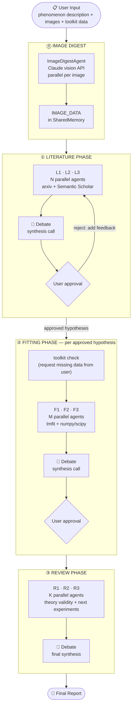

# MTF — My Theorist Friend

A multi-agent AI system for experimental physicists. Describe an unexplained phenomenon; MTF searches the literature, fits your data, and delivers a peer-reviewed report.

---

## Workflow



Images are digested first (phase ⓪): `ImageDigestAgent` uses Claude's vision API to extract quantitative data from plots and figures, storing structured digests in `SharedMemory` before any analysis begins. All downstream agents (literature, fitting, reviewer) automatically see this data in their context. Each analysis phase fans out parallel agents, synthesizes their reports via a single debate call, then waits for your approval before proceeding.

---

## Agents

| Agent | Phase | API | Tools | Memory written | Description |
|-------|-------|-----|-------|----------------|-------------|
| `ImageDigestAgent` | ⓪ Pre-processing | `messages.create()` (multimodal) | — | `IMAGE_DATA` | Encodes each user image as base64 and calls the vision API to extract plot type, axis labels/units/scale, numerical data series, quantitative features, and annotations. Runs in parallel, one instance per image. |
| `LiteratureAgent` | ① Literature | `sdk.query()` | arxiv search, Semantic Scholar | `LITERATURE` | Searches arxiv and Semantic Scholar for papers relevant to the phenomenon. Returns a structured report: phenomenon summary, cited papers, ranked hypotheses, and key equations. Spawns N parallel instances (default 3). |
| `FittingAgent` | ② Fitting | `sdk.query()` | `run_fitting_code()` (exec sandbox) | `FIT_RESULT` | Given an approved hypothesis and toolkit data, writes and executes `lmfit`/`numpy`/`scipy` fitting code. Reports χ², reduced χ², best-fit parameters with uncertainties, and hypothesis support. Rate-limited by `asyncio.Semaphore`. |
| `ReviewerAgent` | ③ Review | `sdk.query()` | — | `REVIEW` | Evaluates hypothesis validity against data and literature, identifies weaknesses and confounds, and proposes specific follow-up experiments to distinguish competing explanations. Spawns K parallel instances (default 3). |
| `ToolBuilderAgent` | ② Fitting (on demand) | `sdk.query()` | — | `TOOLKIT_DIGEST` | Invoked when a fitting agent requests toolkit data that the user has not pre-registered. Parses raw user input (functions, CSVs, code snippets) into `data_items` and `model_items` dicts via LLM-generated `exec()` code, then registers them in `ToolkitRegistry`. |

All agents except `ImageDigestAgent` extend `BaseAgent`, which prepends a formatted `SharedMemory` context block before every `sdk.query()` call so every agent sees prior debate summaries, image digests, and user feedback.

---

## Installation

**Requirements:** Python 3.11+, an Anthropic API key.

```bash
# Clone
git clone https://github.com/your-org/mtf.git
cd mtf

# Option A — pip
pip install -e ".[dev]"

# Option B — conda
conda env create -f environment.yml
conda activate mtf
pip install -e .

# Set your API key
export ANTHROPIC_API_KEY="sk-ant-..."
```

---

## Quick Start

### 1. CLI — no code required

```bash
mtf "We observe a plateau in longitudinal resistivity near B=3T in a 2D electron gas at T=4K. What could explain this?"
```

Include experimental images (plots, figures, photographs) so MTF can read quantitative data from them:

```bash
mtf "Anomalous plateau in rho_xx near B=3T" --images rho_vs_B.png Hall_plot.png
```

Or run interactively (omit the argument and you will be prompted, including whether you have images to provide):

```bash
mtf
```

**Available flags:**

| Flag | Default | Description |
|------|---------|-------------|
| `--n-literature` | 3 | Number of parallel literature agents |
| `--n-fitting` | 3 | Number of parallel fitting agents per hypothesis |
| `--n-reviewer` | 3 | Number of parallel reviewer agents |
| `--max-debate-rounds` | 3 | Max literature debate rounds before auto-proceeding |
| `--literature-model` | `claude-opus-4-6` | Model for literature agents |
| `--fitting-model` | `claude-opus-4-6` | Model for fitting agents |
| `--reviewer-model` | `claude-opus-4-6` | Model for reviewer agents |
| `--debate-model` | `claude-opus-4-6` | Model for debate synthesis |
| `--images` | _(none)_ | Image files to digest (PNG, JPG, GIF, WebP; space-separated) |
| `--image-digest-model` | `claude-opus-4-6` | Model for image digestion |

### 2. Python API — with your own data

Register your experimental data before running so the fitting agents can use it:

```python
import asyncio
import numpy as np
from mtf import MTFConfig, MTFOrchestrator
from mtf.toolkit.registry import ToolkitRegistry

# 1. Load your data
toolkit = ToolkitRegistry()
toolkit.register_data("B_field", np.linspace(0, 10, 200))   # magnetic field (T)
toolkit.register_data("rho_xx", your_rho_xx_array)           # longitudinal resistivity
toolkit.register_data("rho_xy", your_rho_xy_array)           # Hall resistivity

# Optionally register a model function
def drude_model(B, n, mu):
    return 1 / (n * 1.6e-19 * mu) * 1 / (1 + (mu * B)**2)

toolkit.register_model("drude", drude_model)

# 2. Configure
config = MTFConfig(
    n_literature=3,
    n_fitting=3,
    n_reviewer=2,
    max_debate_rounds=2,
)

# 3. Run (optionally pass image paths)
orchestrator = MTFOrchestrator(config=config, toolkit=toolkit)
report = asyncio.run(orchestrator.run(
    "Anomalous resistivity plateau at B=3T in 2DEG at T=4K. What causes this?",
    images=["rho_vs_B.png", "Hall_plot.png"],   # optional
))
```

See `examples/run_experiment.py` for a complete runnable example.

---

## Providing Images

MTF can read quantitative information directly from experimental images using Claude's vision capabilities. Supported formats: **PNG, JPG, GIF, WebP**.

For each image, `ImageDigestAgent` produces a structured digest containing:
- Plot type and physical description
- Axis labels, units, and scale (linear/log)
- All data series as extracted numerical arrays
- Key quantitative features — peak positions, plateau values, slopes, error bars, fit parameters
- Any annotations or equations visible in the figure

The digest is stored as `MemoryKind.IMAGE_DATA` in `SharedMemory` and is automatically included in the context of every literature, fitting, and reviewer agent. This means fitting agents can use plot-extracted data directly, even without registered toolkit arrays.

**CLI:**
```bash
mtf "Describe phenomenon" --images figure1.png figure2.jpg
```

**Python API:**
```python
report = asyncio.run(orchestrator.run("Describe phenomenon", images=["figure1.png"]))
```

**Interactive mode:** When no `--images` flag is given, the CLI will ask whether you have images to provide before starting the analysis.

---

## Providing Data (Toolkit)

Fitting agents will ask for data by name. You can pre-register everything, or supply items interactively when the CLI prompts you.

```python
toolkit = ToolkitRegistry()

# Arrays
toolkit.register_data("temperature", T_array)
toolkit.register_data("intensity", I_array)
toolkit.register_data("frequency", freq_array)

# Scalars / constants
toolkit.register_data("sample_thickness", 1.5e-9)   # meters

# Model functions (optional — agents can also write their own)
toolkit.register_model("lorentzian", lambda x, x0, gamma, A: A * gamma**2 / ((x-x0)**2 + gamma**2))
```

If the fitting agent requests something that is not registered, the CLI will pause and ask you to provide it before continuing.

---

## Shared Memory

All agents share a `SharedMemory` instance that accumulates entries across phases. Agents always see prior debate summaries and your feedback — no retrieval step needed.

```
MemoryKind.IMAGE_DATA      → quantitative digests from user-provided images/plots
MemoryKind.LITERATURE      → raw agent literature reports
MemoryKind.DEBATE          → synthesized summaries from each phase
MemoryKind.USER_FEEDBACK   → guidance you provide between rounds
MemoryKind.HYPOTHESIS      → approved hypotheses passed to fitting
MemoryKind.FIT_RESULT      → fitting agent outputs
MemoryKind.REVIEW          → reviewer agent outputs
```

---

## Project Structure

```
mtf/
├── config.py           MTFConfig dataclass
├── memory.py           SharedMemory + MemoryEntry
├── debate.py           DebateEngine (Anthropic messages.create)
├── interface.py        HumanInterface ABC + CLIInterface (rich)
├── orchestrator.py     MTFOrchestrator.run()
├── cli.py              mtf CLI entry point
├── agents/
│   ├── base.py           BaseAgent (wraps claude-agent-sdk query)
│   ├── image_digest.py   ImageDigestAgent — vision API, quantitative plot extraction
│   ├── literature.py     arxiv + Semantic Scholar search
│   ├── fitting.py        lmfit code generation + execution
│   └── reviewer.py       theory validity + experiment suggestions
├── phases/
│   ├── literature_phase.py   fan-out → debate → approval loop
│   ├── fitting_phase.py      toolkit resolution → fan-out → debate
│   └── review_phase.py       fan-out → final debate
├── tools/
│   ├── arxiv_search.py
│   ├── semantic_search.py
│   └── fitting_tools.py      exec-based sandboxed fitting runner
└── toolkit/
    └── registry.py     ToolkitRegistry (user data + model functions)
```

---

## Running Tests

```bash
# Unit tests — no API key needed
pytest tests/test_memory.py tests/test_debate.py tests/test_phases.py

# All tests including network calls
pytest --run-network

# With coverage
pytest --cov=mtf tests/
```

Network tests (arxiv, Semantic Scholar) are marked `@pytest.mark.network` and skipped by default.

---

## License

MIT
